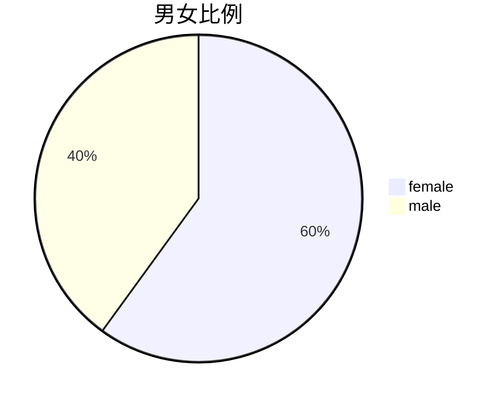
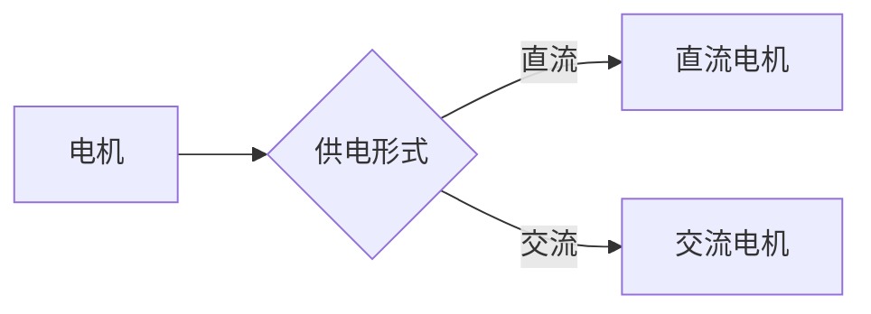

[TOC]

# 一级标题

## 二级标题

### 三级标题

#### 四级标题

段落1

段落2

|  1   |  2   |  3   |
| :--: | :--: | :--: |
|  1   |  2   |  3   |
|  5   |  4   |  3   |
|      |      |      |

```mermaid
pie title 男女比例
	"female": 60
	"male": 40
```

```mermaid
graph LR
A["电机"]-->D{"供电形式"}
D-->|直流|B[直流电机];
D-->|交流|C[交流电机];
```

==高亮显示==

H~2~O~2~

N^n^
